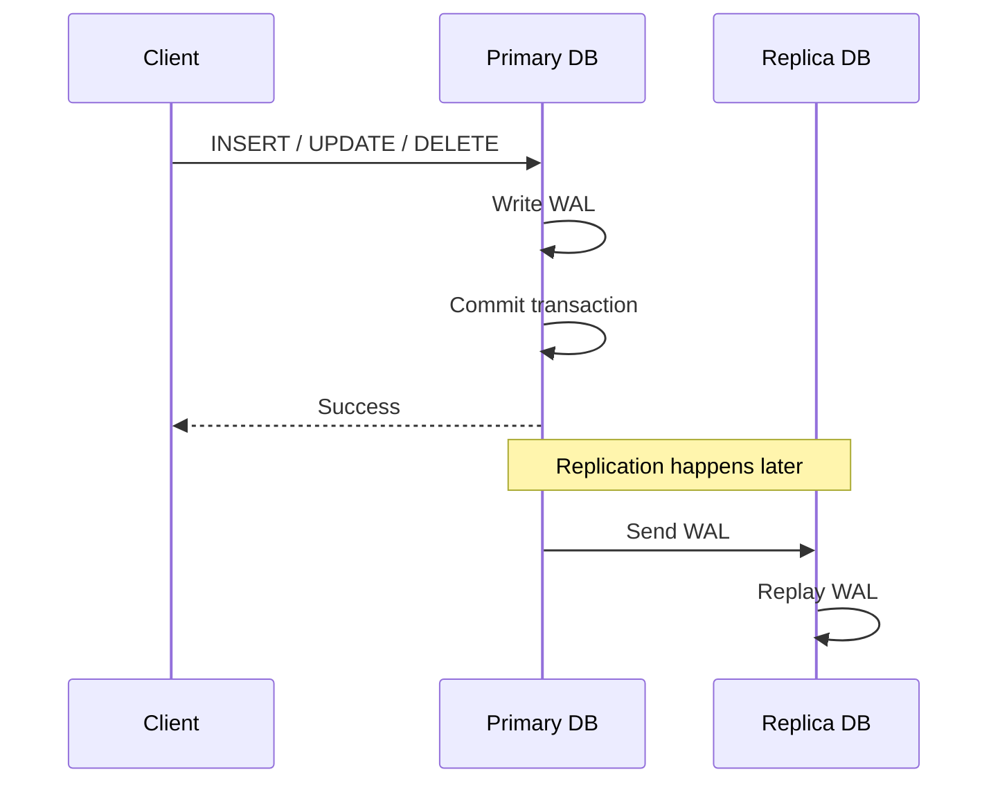

# Asynchronous Replication (Bất đồng bộ)

Primary commit và trả về `Success` cho client **ngay sau khi** ghi local, **không chờ** replica. Việc gửi và replay WAL tới replica diễn ra sau đó (background).

## Sequence Diagram

## Điểm mạnh

- **Latency thấp / throughput cao:** Client không phải chờ replica, ghi nhanh.
- **Không phụ thuộc replica:** Replica chậm hoặc chết không ảnh hưởng tới ghi trên primary.
- **Phù hợp địa lý xa:** Có thể đặt replica ở khu vực khác mà không làm chậm ghi.

## Điểm yếu

- **Có thể mất dữ liệu (RPO > 0):** Nếu primary chết trước khi WAL được gửi đi, các giao dịch đã commit nhưng chưa kịp replicate sẽ mất.
- **Replication lag:** Replica có độ trễ → đọc trên replica có thể trả về dữ liệu cũ (eventual consistency).
- **Failover rủi ro:** Khi chuyển sang replica có thể thiếu một phần dữ liệu mới nhất.

## Khi nào dùng

Hệ thống ưu tiên hiệu năng và khả năng mở rộng, chấp nhận mất một lượng nhỏ dữ liệu khi sự cố: analytics, read-replica cho báo cáo, cache, log.
