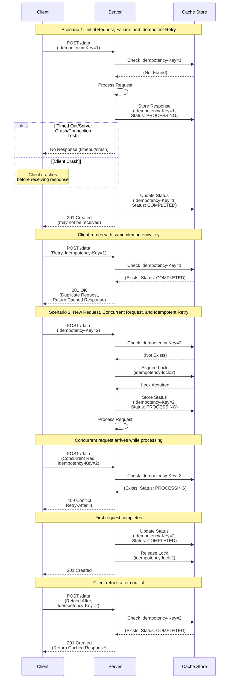

# Idempotency Key Flow Diagram

## Sequence Diagram

## Key Concepts

### Idempotency Key

- Unique identifier sent by client in `Idempotency-Key` header
- Ensures that duplicate requests result in the same state change
- Allows safe retries after network failures or client crashes

### Server-Side State Management

- **Cache Store (Redis)**: Stores idempotency key statuses and responses
- **Statuses**:
  - `Not Found`: Key doesn't exist (first request)
  - `PROCESSING`: Request is currently being processed
  - `COMPLETED`: Request completed successfully, response cached

### Lock Mechanism

- Uses distributed lock (`idempotency-lock:{key}`) to prevent concurrent processing
- Lock expires after 60 seconds (longer than max processing time)
- Ensures only one request processes at a time for the same key

### Response Handling

1. **First Request (Not Found)**:
   - Acquire lock
   - Mark as PROCESSING
   - Process request
   - Store result as COMPLETED
   - Return 201 Created

2. **Retry Request (COMPLETED)**:
   - Check cache, find COMPLETED status
   - Return cached response with 201 Created
   - No re-processing

3. **Concurrent Request (PROCESSING)**:
   - Check cache, find PROCESSING status
   - Return 409 Conflict with Retry-After header
   - Client should retry after delay

4. **Retry After Conflict**:
   - Check cache again
   - If COMPLETED, return cached response
   - If still PROCESSING, return 409 again

### Error Handling

- Network timeouts: Client can safely retry with same key
- Client crashes: Client can retry without duplicate operations
- Server crashes: Lock expires, allowing retry (may need idempotent operations)
- Processing errors: Cache is cleaned up, allowing retry
