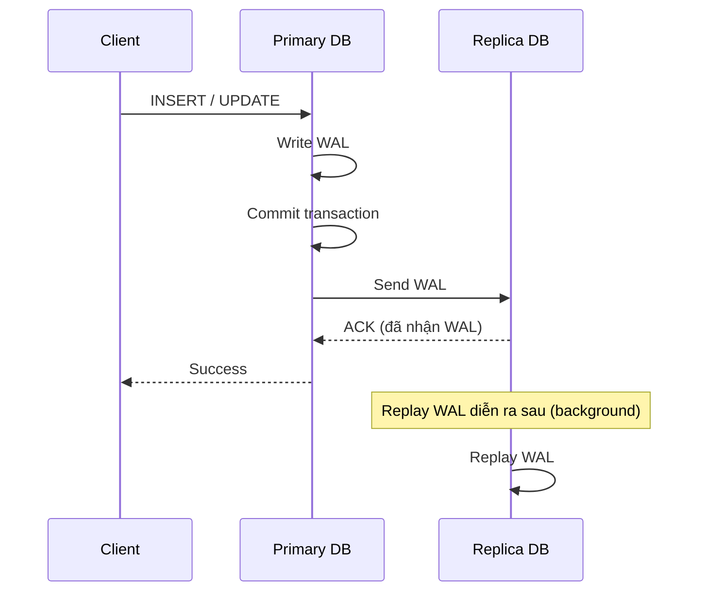

# Semi-synchronous Replication (Bán đồng bộ)

Dung hòa giữa sync và async: Primary chờ **ít nhất một** replica xác nhận đã **nhận** WAL (ghi vào WAL/relay log) rồi mới trả `Success`, **nhưng không cần chờ replica replay** xong. Đây là cân bằng giữa độ an toàn dữ liệu và độ trễ.

## Sequence Diagram

## Điểm mạnh

- **Giảm rủi ro mất dữ liệu so với async:** Đảm bảo ít nhất một replica đã nhận WAL trước khi báo thành công.
- **Latency thấp hơn sync:** Chỉ chờ replica nhận (ACK), không chờ replay xong.
- **Cân bằng tốt:** Phù hợp khi cần độ bền dữ liệu cao mà vẫn giữ hiệu năng chấp nhận được.

## Điểm yếu

- **Vẫn có cửa sổ mất dữ liệu nhỏ:** Replica mới nhận WAL nhưng chưa replay; nếu cả primary và replica đó cùng hỏng đúng lúc vẫn có rủi ro.
- **Latency cao hơn async:** Vẫn phải chờ một round-trip ACK từ replica.
- **Có cơ chế fallback:** Nhiều DB tự động hạ xuống async khi không có replica nào ACK trong timeout → lúc đó tạm thời mất bảo đảm bán đồng bộ.

## So sánh nhanh

| Tiêu chí | Sync | Semi-sync | Async |
|---|---|---|---|
| Độ trễ ghi | Cao | Trung bình | Thấp |
| Rủi ro mất dữ liệu (RPO) | 0 | Rất thấp | Có thể cao |
| Phụ thuộc replica | Cao | Trung bình | Thấp |
| Consistency | Mạnh | Gần mạnh | Eventual |

## Khi nào dùng

Hệ thống cần độ bền dữ liệu cao nhưng không thể chấp nhận latency của sync hoàn toàn: e-commerce, đơn hàng, các giao dịch quan trọng vừa phải.
