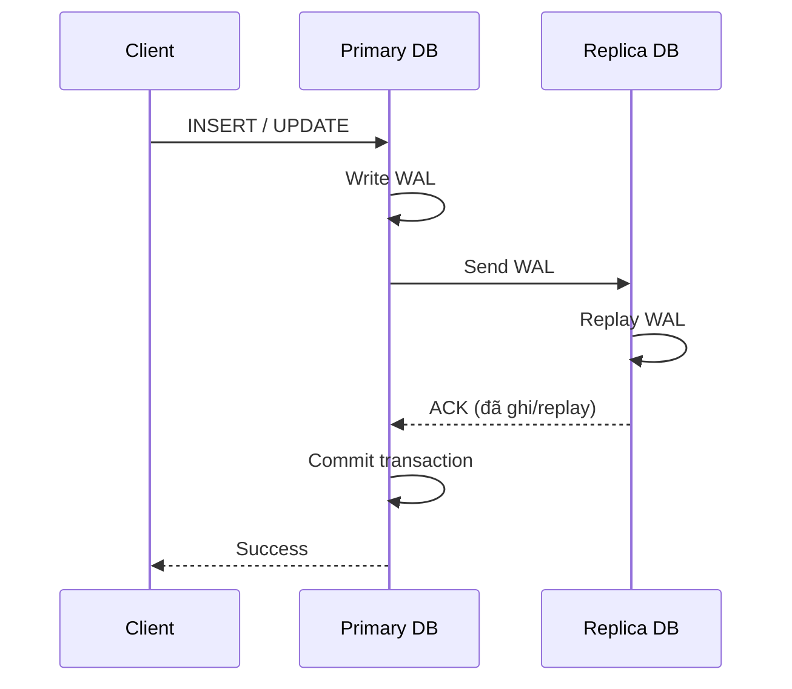

# Synchronous Replication (Đồng bộ)

Primary chỉ commit và trả về `Success` cho client **sau khi** replica đã xác nhận nhận (và/hoặc replay) WAL. Client phải chờ cả primary lẫn replica.

## Sequence Diagram

## Điểm mạnh

- **Không mất dữ liệu (RPO = 0):** Khi primary chết, replica luôn có đầy đủ dữ liệu đã commit.
- **Tính nhất quán mạnh (strong consistency):** Đọc trên replica đảm bảo thấy dữ liệu mới nhất đã commit.
- **Failover an toàn:** Có thể chuyển sang replica mà không lo mất giao dịch.

## Điểm yếu

- **Latency cao:** Mỗi ghi phải chờ round-trip mạng tới replica → tăng độ trễ, giảm throughput.
- **Phụ thuộc replica:** Nếu replica chậm hoặc chết, ghi trên primary có thể bị treo/từ chối.
- **Khó scale theo khoảng cách địa lý:** Replica càng xa, latency càng lớn.

## Khi nào dùng

Hệ thống tài chính, thanh toán, dữ liệu quan trọng không được phép mất (yêu cầu RPO = 0).
